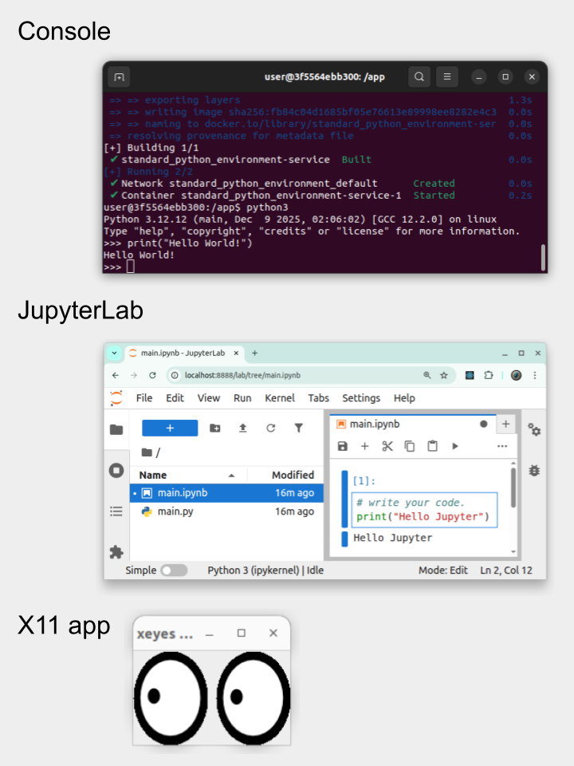

# [Standard Python Environment](https://github.com/europanite/standard_python_environment "Standard Python Environment")

[](https://opensource.org/licenses/Apache-2.0)
[](https://www.python.org/)


[](https://github.com/europanite/standard_python_environment/actions/workflows/ci.yml)
[](https://github.com/europanite/standard_python_environment/actions/workflows/lint.yml)
[](https://github.com/europanite/standard_python_environment/actions/workflows/pytest.yml)
[](https://github.com/europanite/standard_python_environment/actions/workflows/pages/pages-build-deployment)
[](https://github.com/europanite/standard_python_environment/actions/workflows/codeql.yml)


A standard **Python** environment built with **Docker Compose**.



---

## Features

- **Reproducibility**: Dependencies are locked inside the container
- **Simplicity**: Run with just docker compose commands
- **Portability**: Works on Linux, macOS, and Windows
- **pip ready**: Install and manage Python packages easily
- **JupyterLab support**: (Optional) Run notebooks inside the container
- **X11 forwarding**: (Optional) Run GUI-based Python apps

---


## Requirements

- [Docker Compose](https://docs.docker.com/compose/)

---

## Getting Started

### Linux

```bash
# Clone this repository
git clone https://github.com/europanite/standard_python_environment.git
cd standard_python_environment

# Export host UID/GID
export HOST_UID=$(id -u) 
export HOST_GID=$(id -g)

# Build and run
docker compose build
docker compose up -d
docker compose exec service bash
```

### Windows

```powershell
# Clone this repository
git clone https://github.com/europanite/standard_python_environment.git
cd standard_python_environment

# Build and run
docker compose build
docker compose up -d
docker compose exec service bash
```

Now you are inside the Python container 🎉

If you use JupyterLab, just you need to access http://localhost:8888

---

### Test

```bash
# pytest
docker compose \
-f docker-compose.test.yml run \
--rm \
--entrypoint /bin/sh service_test \
-lc 'pytest'

# Lint
docker compose \
-f docker-compose.test.yml run \
--rm \
--entrypoint /bin/sh service_test \
-lc 'ruff check /app /tests'
```

## License
- Apache License 2.0