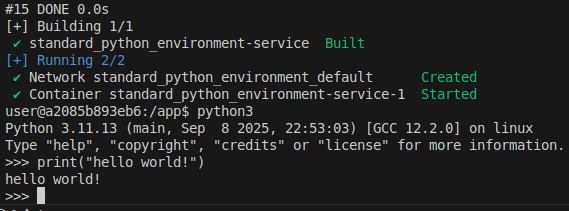

# Standard Python Environment

A standard **Python** environment built with **Docker Compose**.
It is useful when you want to use Python without installing it or dependencies directly on your machines.



---

## Features

- **Reproducibility**: Dependencies are locked inside the container
- **Simplicity**: Run with just docker compose commands
- **Portability**: Works on Linux, macOS, and Windows
- **pip ready**: Install and manage Python packages easily
- **JupyterLab support**: (Omitted in this branch) Run notebooks inside the container
- **X11 forwarding**: (Optional) Run GUI-based Python apps
---


## Prerequisites

- Docker (Docker Desktop, etc.)
- Docker Compose v2 (`docker compose` command available)

---

## Getting Started

```bash

# Clone this repository
git clone https://github.com/europanite/standard_python_environment.git
cd standard_python_environment

# Export host UID/GID
export HOST_UID=$(id -u) 
export HOST_GID=$(id -g)

# Build and run
docker compose build
docker compose up -d
docker compose exec service bash

```
Now you are inside the Python container 🎉

You cannot use JupyterLab because this is a simple branch.

---

## License
- Apache License 2.0
