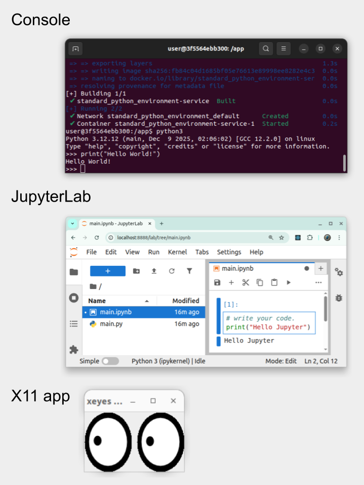

[](https://www.python.org/)


[](https://github.com/europanite/standard_python_environment/actions/workflows/ci.yml)
[](https://github.com/europanite/standard_python_environment/actions/workflows/lint.yml)
[](https://github.com/europanite/standard_python_environment/actions/workflows/pytest.yml)
[](https://github.com/europanite/standard_python_environment/actions/workflows/pages/pages-build-deployment)
[](https://github.com/europanite/standard_python_environment/actions/workflows/codeql.yml)

<p align="right">
  <a href="/standard_python_environment/">🇺🇸 English</a> |
  <a href="/standard_python_environment/hi/">🇮🇳 हिन्दी</a> |
  <a href="/standard_python_environment/ja/">🇯🇵 日本語</a> |
  <a href="/standard_python_environment/zh-CN/">🇨🇳 简体中文</a> |
  <a href="/standard_python_environment/es/">🇪🇸 Español</a> |
  <a href="/standard_python_environment/pt-BR/">🇧🇷 Português (Brasil)</a> |
  <a href="/standard_python_environment/ko/">🇰🇷 한국어</a> |
  <a href="/standard_python_environment/de/">🇩🇪 Deutsch</a> |
  <a href="/standard_python_environment/fr/">🇫🇷 Français</a>
</p>

Um ambiente **Python** padrão criado com **Docker Compose**.



---

## Recursos

- **Reprodutibilidade**: As dependências ficam fixadas dentro do contêiner
- **Simplicidade**: Execute apenas com comandos docker compose
- **Portabilidade**: Funciona em Linux, macOS e Windows
- **pip ready**: Instale e gerencie pacotes Python com facilidade
- **JupyterLab support**: (Opcional) Execute notebooks dentro do contêiner
- **X11 forwarding**: (Opcional) Execute aplicativos Python com interface gráfica

---


## Requisitos

- [Docker Compose](https://docs.docker.com/compose/)

---

## Primeiros passos

### Linux

```bash
# Clone this repository
git clone https://github.com/europanite/standard_python_environment.git
cd standard_python_environment

# Export host UID/GID
export HOST_UID=$(id -u) 
export HOST_GID=$(id -g)

# Build and run
docker compose build
docker compose up -d
docker compose exec service bash
```

### Windows

```powershell
# Clone this repository
git clone https://github.com/europanite/standard_python_environment.git
cd standard_python_environment

# Build and run
docker compose build
docker compose up -d
docker compose exec service bash
```

Agora você está dentro do contêiner Python 🎉

Se você usa o JupyterLab, basta acessar http://localhost:8888

---

### Teste

```bash
# pytest
docker compose \
-f docker-compose.test.yml run \
--rm \
--entrypoint /bin/sh service_test \
-lc 'pytest'

# Lint
docker compose \
-f docker-compose.test.yml run \
--rm \
--entrypoint /bin/sh service_test \
-lc 'ruff check /app /tests'
```

## Licença
- Apache License 2.0
